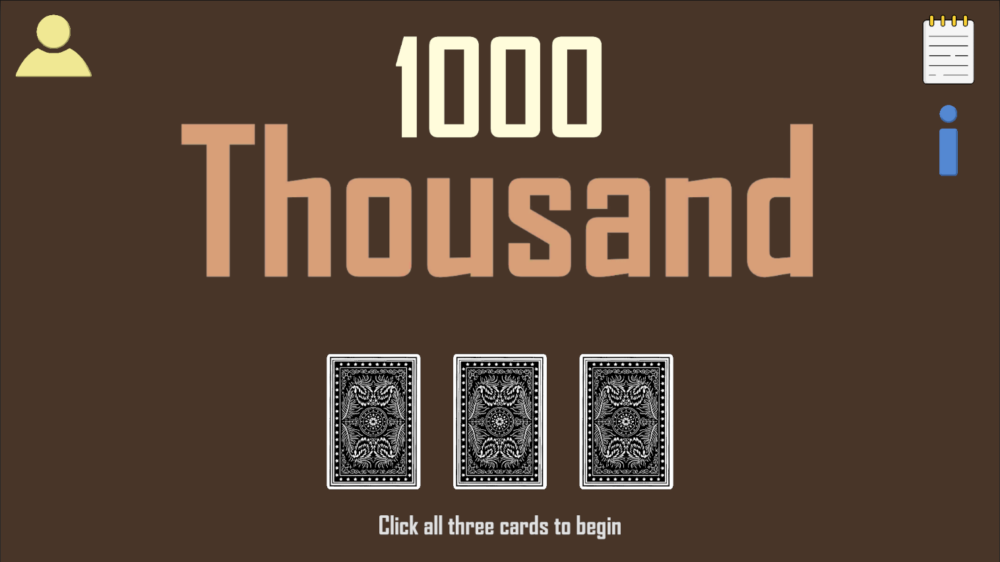
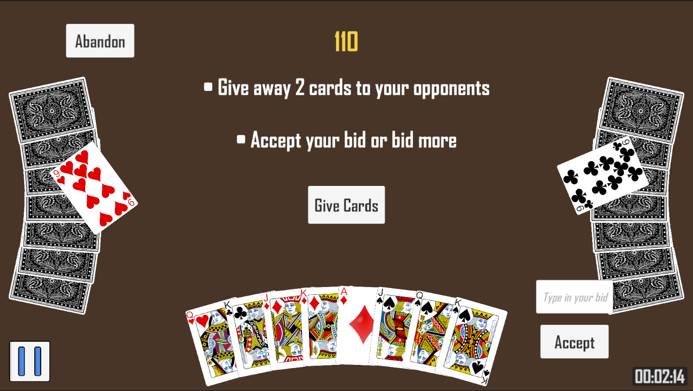
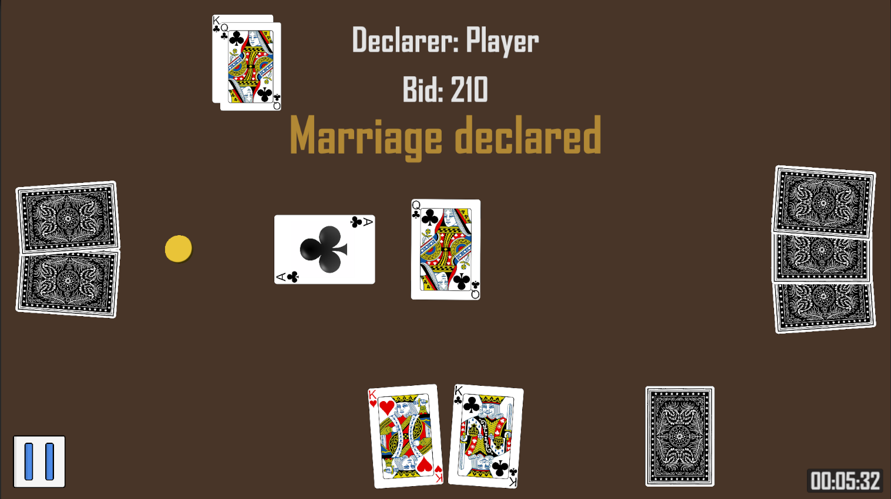

# Thousand

## Description
A trick-taking card game. The objective is to be the first player to accumulate 1000 points. 
Points are earned by winning tricks containing valuable cards and through "marriages" (king and queen of the same suit).

This project was developed in **Unity** using **C#**.  
Developed as a personal project to improve Unity skills and learn game architecture design.

## Features
- Turn-based mechanics
- Custom UI and graphics
- Custom card animations
- Simple enemy logic (AI turns)
- Cards playing system

## Technologies Used
- Engine: Unity
- Language: C#
- IDE: Visual Studio 2022
- Platform: developed for Android (also playable on Windows)

## Screenshots
  

## License / Usage
This project is shared for demonstration and educational purposes only.
All rights reserved © 2025 Krzysztof Sobczyk.
Please do not reuse or distribute without permission.

## Inspiration & Credits
Cards graphics: [Playing Cards](https://opengameart.org/content/playing-cards-vector-png)\
Cards back: [Colorful Poker Card Back](https://opengameart.org/content/colorful-poker-card-back)

## About the Author
Developed by Krzysztof Sobczyk, Unity and C# enthusiast focused on developing small indie-style games and learning by doing.
Feel free to connect or reach out if you have questions!\
Email: [ksobczyk.poczta@gmail.com]
